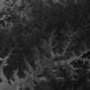
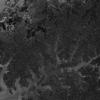
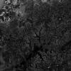
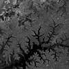
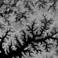
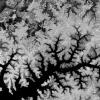
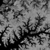
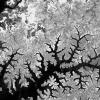
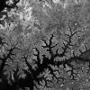

# Sentinel-2 Bands

## Band 1

### B01 (aerosol)

- Resolution = 60m/px
- Central Wavelength = 443nm
- Bandwidth = 20nm

Use: For aerosol detection.

Custom script: ** return [B01];**

## Band 2

### B02 (blue)

- Resolution = 10m/px
- Central Wavelength = 490nm
- Bandwidth = 65nm

Use: Band 2 is useful for soil and vegetation discrimination, forest type mapping and identifying man-made features. It is scattered by the atmosphere, it illuminates material in shadows better than longer wavelengths, and it  penetrates clear water better than other colors. It is absorbed by chlorophyll, which results in darker plants. 

Custom script: ** return [B02];**

## Band 3

### B03 (green)

- Resolution = 10m/px
- Central Wavelength = 560nm
- Bandwidth = 35nm

Use: It gives excellent contrast between clear and turbid (muddy) water, and penetrates clear water fairly well. It helps in highlighting oil on water surfaces, and vegetation. It reflects green light stronger than any other visible color. Man-made features are still visible.

Custom script: ** return [B03];**

## Band 4

### B04 (red)

- Resolution = 10m/px
- Central Wavelength = 665nm
- Bandwidth = 30nm

Use: It is strongly reflected by dead foliage and is useful for identifying vegetation types, soils and urban (city and town) areas. It has limited water penetration and doesn’t reflect well from live foliage with chlorophyll.

Custom script: ** return [B04];**

## Band 5

### B05 (red edge)

- Resolution = 20m/px
- Central Wavelength = 705nm
- Bandwidth = 15nm

Use: For classifying vegetation.

Custom script: ** return [B05];**

## Band 6

### B06

- Resolution = 20m/px
- Central Wavelength = 740nm
- Bandwidth = 15nm

Use: For classifying vegetation.

Custom script: ** return [B06];**

## Band 7

### B07

- Resolution = 20m/px
- Central Wavelength = 783nm
- Bandwidth = 20nm

Use: For classifying vegetation.

Custom script: ** return [B07];**

## Band 8

### B08 (NIR)

- Resolution = 10m/px
- Central Wavelength = 842nm
- Bandwidth = 115nm

Use: The near infrared band is good for mapping shorelines and biomass content, as well as at detecting and analyzing vegetation.

Custom script: ** return [B08];**

## Band 8A

### B8A

- Resolution = 20m/px
- Central Wavelength = 865nm
- Bandwidth = 20nm

Use: For classifying vegetation.

Custom script: ** return [B8A];**

## Band 9

### B09

- Resolution = 60m/px
- Central Wavelength = 945nm
- Bandwidth = 20nm

Use: It is good for detecting water vapour.

Custom script: ** return [B09];**

## Band 10

### B10

- Resolution = 60m/px
- Central Wavelength = 1375nm
- Bandwidth = 30nm

Use: For cirrus cloud detection.

Custom script: ** return [B10];**

## Band 11 

### B11 (SWIR 1)

- Resolution = 20m/px
- Central Wavelength = 1610nm
- Bandwidth = 90nm

Use: It is useful for measuring the moisture content of soil and vegetation, and it provides good contrast between different types of vegetation. It helps differentiate between snow and clouds. On the other hand, it has limited cloud penetration..

Custom script: ** return [B11];****

## Band 12 

### B12 (SWIR 2)

- Resolution = 20m/px
- Central Wavelength = 2190nm
- Bandwidth = 180nm

Use: It is useful for measuring the moisture content of soil and vegetation, and it provides good contrast between different types of vegetation. It helps differentiate between snow and clouds. On the other hand, it has limited cloud penetration.

Custom script: ** return [B12];**

